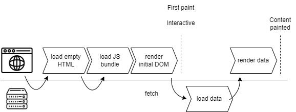
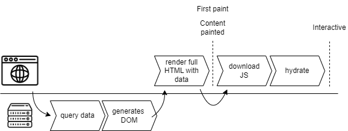

# csr-rsc-ssg-isr-ssr-ssrf

## CSR Client Side Rendering

### `1-csr-load-data` vanilla react SPA loading data

> [!IMPORTANT]
> Using App Router

> CSR (Client-Side Rendering): React code is delivered to the browser, which generates content that is inserted into the DOM.



Constater côté navigateur `console.log('executing App.js');`

[https://demystifying-rsc.vercel.app/notes/](https://demystifying-rsc.vercel.app/notes/)

(quelles perfs pour la séquence "load bundle, generate DOM, load data, hydrate component")

### `2-csr-router` vanilla react SPA routing

==Using App Router==


## RSC React Server Components

### `3-rsc-load-data` React Server Cmponents (nextJS impl) loading data

==Using App Router==

> React components which are written to run *only* on the server, rather than in the browser.



Constater côté serveur `console.log('executing page.js');`

[https://nextjs.org/docs/app/building-your-application/rendering/server-components#how-are-server-components-rendered](https://nextjs.org/docs/app/building-your-application/rendering/server-components#how-are-server-components-rendered)

[https://github.com/reactwg/server-components/discussions/4](https://github.com/reactwg/server-components/discussions/4)

### `4-rsc-router` React Server Cmponents (nextJS impl) routing

==Using App Router==


## `5-SSR` SSR Server Side Rendering

==Using App Router==

> Prerendering client components on the server

> SSR (Server-Side Rendering): React code runs at the time it is requested. The result may be cached for future requests.


"X RSC with interactivity (client components)"

[https://react.dev/reference/rsc/server-components#adding-interactivity-to-server-components](https://react.dev/reference/rsc/server-components#adding-interactivity-to-server-components)

[https://nextjs.org/docs/pages/building-your-application/data-fetching/incremental-static-regeneration](https://nextjs.org/docs/pages/building-your-application/data-fetching/incremental-static-regeneration)

[https://demystifying-rsc.vercel.app/notes/](https://demystifying-rsc.vercel.app/notes/)

[https://nextjs.org/docs/pages/building-your-application/rendering/server-side-rendering](https://nextjs.org/docs/pages/building-your-application/rendering/server-side-rendering)

## `6-ssg` (nextJS impl)

==Using Pages Router==

> SSG (Static Site Generation): React code is run when you build your application, and the generated output is static.

```
npm run build
```

```
npm run start
```

SSG --> SSR :

> the data could become stale at request time

[https://vercel.com/blog/nextjs-server-side-rendering-vs-static-generation](https://vercel.com/blog/nextjs-server-side-rendering-vs-static-generation)

## X ISR 

[https://nextjs.org/docs/pages/building-your-application/data-fetching/incremental-static-regeneration](https://nextjs.org/docs/pages/building-your-application/data-fetching/incremental-static-regeneration)

> In the Next.js App Router, all fetched data is now static by default, rendered at build time. However, this can be changed easily: Next.js extends the fetch options object to provide flexibility in caching and revalidating rules. You can use the {next: {revalidate: number}} option to refresh static data at set intervals or when backend changes occur (Incremental Static Regeneration), while the {cache: 'no-store'} option can be passed in the fetch request for dynamic data (server-side rendering).

[https://vercel.com/blog/understanding-react-server-components](https://vercel.com/blog/understanding-react-server-components)

## Difference RSC SSR

[https://stackoverflow.com/questions/76325862/what-is-the-difference-between-react-server-components-rsc-and-server-side-ren](https://stackoverflow.com/questions/76325862/what-is-the-difference-between-react-server-components-rsc-and-server-side-ren)

[https://github.com/reactjs/server-components-demo?tab=readme-ov-file#should-i-use-this-demo-for-benchmarks](https://github.com/reactjs/server-components-demo?tab=readme-ov-file#should-i-use-this-demo-for-benchmarks)

[https://github.com/reactjs/rfcs/blob/main/text/0188-server-components.md#does-this-replace-ssr](https://github.com/reactjs/rfcs/blob/main/text/0188-server-components.md#does-this-replace-ssr)

[https://www.youtube.com/watch?v=jEJEFAc8tSI](https://www.youtube.com/watch?v=jEJEFAc8tSI)

## Hydration

> "In React, “hydration” is how React “attaches” to existing HTML that was already rendered by React in a server environment. During hydration, React will attempt to attach event listeners to the existing markup and take over rendering the app on the client. In apps fully built with React, you will usually only hydrate one “root”, once at startup for your entire app."

[https://react.dev/reference/react-dom/client/hydrateRoot](https://react.dev/reference/react-dom/client/hydrateRoot)

[https://www.gatsbyjs.com/docs/conceptual/partial-hydration/](https://www.gatsbyjs.com/docs/conceptual/partial-hydration/)

## Server actions

[https://react.dev/reference/rsc/server-actions](https://react.dev/reference/rsc/server-actions)

## SSRF (fixed in NextJS v14.1.1)

[https://www.assetnote.io/resources/research/digging-for-ssrf-in-nextjs-apps](https://www.assetnote.io/resources/research/digging-for-ssrf-in-nextjs-apps)

## Notes

### "Extra attributes from the server"

[https://stackoverflow.com/questions/75337953/what-causes-nextjs-warning-extra-attributes-from-the-server-data-new-gr-c-s-c](https://stackoverflow.com/questions/75337953/what-causes-nextjs-warning-extra-attributes-from-the-server-data-new-gr-c-s-c)

### "getStaticProps" is not supported in app/. Read more: https://nextjs.org/docs/app/building-your-application/data-fetching

[https://nextjs.org/docs/app/building-your-application/upgrading/app-router-migration#static-site-generation-getstaticprops](https://nextjs.org/docs/app/building-your-application/upgrading/app-router-migration#static-site-generation-getstaticprops)


[https://nextjs.org/docs/app/building-your-application/upgrading/app-router-migration#step-4-migrating-pages](https://nextjs.org/docs/app/building-your-application/upgrading/app-router-migration#step-4-migrating-pages)

> Pages in the app directory are Server Components by default. This is different from the pages directory where pages are Client Components.

> Upgrading to Next.js 13 does not require using the new App Router. You can continue using pages with new features that work in both directories

## old doc

[https://www.telerik.com/blogs/current-state-react-server-components-guide-perplexed](https://www.telerik.com/blogs/current-state-react-server-components-guide-perplexed)

[https://react.dev/blog/2023/03/22/react-labs-what-we-have-been-working-on-march-2023#react-server-components](https://react.dev/blog/2023/03/22/react-labs-what-we-have-been-working-on-march-2023#react-server-components)

[https://github.com/reactjs/server-components-demo](https://github.com/reactjs/server-components-demo)

[https://dev.to/vteacher/let-s-make-a-web-application-with-react-server-components-5dmg](https://dev.to/vteacher/let-s-make-a-web-application-with-react-server-components-5dmg)

[https://react.dev/blog/2024/04/25/react-19](https://react.dev/blog/2024/04/25/react-19)

[https://react.dev/reference/rsc/server-components](https://react.dev/reference/rsc/server-components)

[https://www.youtube.com/watch?v=ePAPd9qzGyM](https://www.youtube.com/watch?v=ePAPd9qzGyM)

[https://www.joshwcomeau.com/react/server-components/](https://www.joshwcomeau.com/react/server-components/)

[https://nextjs.org/docs/app/building-your-application/rendering/server-components#server-rendering-strategies](https://nextjs.org/docs/app/building-your-application/rendering/server-components#server-rendering-strategies)

[https://nextjs.org/docs/pages/building-your-application/rendering/static-site-generation](https://nextjs.org/docs/pages/building-your-application/rendering/static-site-generation)

[https://nextjs.org/docs/pages/building-your-application/data-fetching/get-static-props](https://nextjs.org/docs/pages/building-your-application/data-fetching/get-static-props)

[https://react.dev/reference/rsc/server-components#server-components-without-a-server](https://react.dev/reference/rsc/server-components#server-components-without-a-server)
